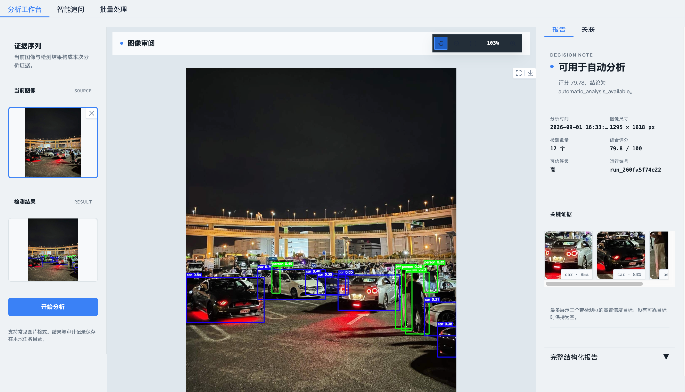
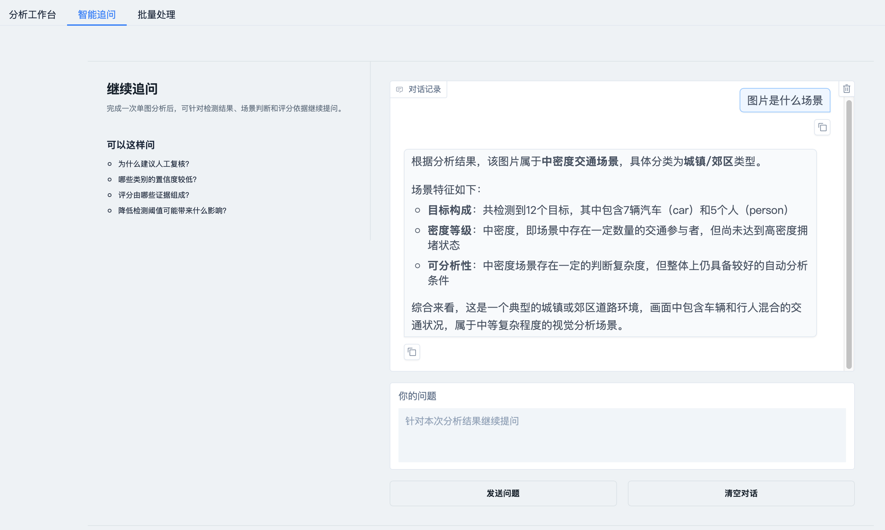
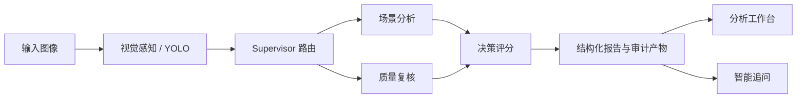

# 多agent视觉感知与可解释决策

> 面向图像理解任务的多 Agent 决策工作台。它把目标检测、场景分析、质量复核、决策评分和可追溯报告编排为一条可审计的分析链路。


## 界面预览

### 分析工作台

从左至右依次呈现证据序列、可交互主画布与决策报告。用户可直接核验原图、检测标注、关键证据和评分结论。



### 智能追问

追问模块携带当前分析上下文，支持以流式方式解释场景、检测结果与决策依据。



## 核心能力

| 能力 | 说明 |
| --- | --- |
| 多 Agent 编排 | 以 LangGraph 协同视觉感知、场景分析、质量复核、评分决策和报告持久化。 |
| 可解释决策 | 输出检测数量、置信度、图像质量、评分分解、人工复核原因和完整审计链路。 |
| 证据化工作台 | 以“证据序列 + 主画布 + 报告”的三栏结构呈现分析过程和结论。 |
| 图像审阅 | 主画布支持拖拽、滚轮缩放、按钮缩放、复位及快捷键控制。 |
| 智能追问 | 对接 DeepSeek API，依据本次结果进行流式、多轮问答。 |
| 会话恢复 | 在同一浏览器会话内切换工作台与智能追问，可恢复当前的图像、检测结果和报告。 |

## 工作流



## 快速开始

### 1. 创建环境

推荐使用 Python 3.12：

```bash
python3.12 -m venv .venv
source .venv/bin/activate
pip install -r requirements.txt
```

### 2. 配置环境变量

```bash
cp .env.example .env
```

如需使用“智能追问”或 LLM 报告生成，请在 `.env` 中填写 `DEEPSEEK_API_KEY`。密钥只应保存在本地或部署平台的环境变量中，切勿提交到 Git。

### 3. 启动应用

```bash
APP_PORT=7861 GRADIO_SERVER_NAME=127.0.0.1 python app.py
```

打开 <http://127.0.0.1:7861>。

首次真实推理需要可用的 YOLO 权重。默认 `yolov8n.pt` 可由 Ultralytics 下载；生产环境建议通过挂载卷或模型仓库提供权重文件。

## 测试

```bash
python -m pytest -q
```

测试覆盖评分规则、工作流路由、数据校验、流式追问和工作台状态恢复。

## 项目结构

```text
.
├── app.py                       # Gradio 工作台入口
├── enhanced_auditable_agent.py  # LangGraph 工作流与报告持久化
├── chat_agent.py                # DeepSeek 流式追问
├── agents/                      # 视觉、场景、质量、评分 Agent
├── assets/                      # README 展示图片
├── tests/                       # 自动化测试
├── scoring_rules.yaml           # 可解释评分规则
├── .env.example                 # 环境变量模板，不含密钥
├── Dockerfile                   # 容器化部署入口
└── render.yaml                  # Render 部署声明
```

## 部署

项目提供 Dockerfile，可部署至 Render、Railway 或任意 Docker 平台。以 Render 为例：

1. 将仓库推送到 GitHub。
2. 在 Render 中使用仓库根目录的 `render.yaml` 创建 Web Service。
3. 在服务环境变量中填写 `DEEPSEEK_API_KEY`，不要写入仓库。
4. 如需保留模型与报告产物，为模型权重和 `reports/` 配置持久化存储。

## 技术栈

Python · Gradio · LangGraph · Ultralytics YOLO · Pydantic · DeepSeek API

## 安全说明

- `.env`、日志、缓存、报告和模型权重均由 `.gitignore` 排除。
- 推送前请确认历史提交、截图和文档中不含 API Key；如密钥曾泄露，请先在供应商控制台轮换。
